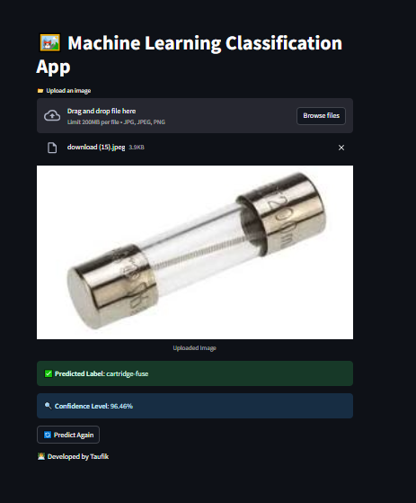

# ✨ Project UAP Klasifikasi Otomatis electronic components dengan MobilenetV2 dan ResNet50 ✨

**Link Dataset yang digunakan:** [Electronic datasets](https://www.kaggle.com/datasets/aryaminus/electronic-components). Preprocessing yang digunakan antara lain Resizing, Augmentation 1:4. Dataset tidak semua nya digunakan saya hanya mengambil sebagian class yg ingin saya gunakan antara lain yaitu :
***Electrolytic-capacitor, LED, armature, attenuator,cartridge-fuse, clip-lead, filament, heat-sink, jumper-cable, limiter-clipper, memory-chip, microchip, microprocessor, potentiometer, pulse-generator, semiconductor-diode, solenoid, step-down-transformer*** 

Model yang digunakan: Mengunanakan Pre Trained Model ***MobilenetV2*** Dan ***ResNet50***

## Overview Dataset
Dataset yang digunakan adalah link sebagai [berikut](https://www.kaggle.com/datasets/aryaminus/electronic-components). Dataset terdiri atas kurang lebih 11.000 data dan sudah hilangkan sebagaian class nya yg menjadi 6626 data mengunakan configurasi data split 80% sebagai *Training Set*, 10% sebagai *Validation Set*, dan 10% sebagai *Testing Set*, dimana pada setiap Set, terdapat 18 Label Class yaitu *Electrolytic-capacitor'*, *'LED,'*,*'armature'*,'*attenuator*','*cartridge-fuse*','*clip-lead*','*filament*','*heat-sink*','*jumper-cable*'.'*limiter-clipper*','*memory-chip*','*microchip*','*microprocessor*','*potentiometer*','*pulse-generator*','*semiconductor-diode*','*solenoid*','*step-down-transformer*'

## Preprocessing & Modelling

### MobilenetV2 Model ✨
**Preprocessing**

Preprocessing yang dilakukan antara lain adalah resizing **(224,224)**, lalu rescale / normalization dengan rentang 1./255, lalu melakukan augmentasi dengan parameter seperti *rotation_range* yang diatur ke **20**, *width_shift_range* diatur ke **0.2**, *height_shift_range* diatur ke **0.2** dan *zoom_range* diatur ke **0.1** . Setelah augmentasi selesai dilakukan, langkah terakhir adalah *splitting* dataset menjadi 3 *(Training, Validation, dan Testing)* sesuai dengan penjelasan pada Dataset.

**Modelling**

Hasil dari MobilenetV2 yang telah dibangun adalah sebagai berikut :

**Model Evaluation**

Berikut adalah hasil dari MobilenetV2 Model yang telah dibangun :

Plot diatas menunjukkan bahwa training acc dapat diatas **80%**, namun validation acc nya pada rentang **40 hingga 60%**.

Plot diatas menunjukkan bahwa loss dari training set mengalami penurunan dari **2.0** hingga **0.6**, sedangkan val_loss dengan rentang loss antara **1.6 stabil hingga 1.2**.

Gambar diatas merupakan *Classification Report* dari Model setelah dilakukan *predict* terhadap *Testing Set*. Dapat dilihat bahwa Akurasinya mencapai **66%** dengan hasil prediksi tertinggi pada label *'cartridge-fuse'* dapat di **87%** dan hasil terendah pada label *'microchip'* dapat di **41%**

Matriks di atas adalah hasil dari model yg telah di gunakan bisa dilihat semakin pekat warnanya maka semakin bagus hasil prediksinya

### ResNet50 Model ✨
**Preprocessing**

Preprocessing yang dilakukan antara lain adalah resizing **(224,224)**, lalu rescale / normalization dengan rentang 1./255, lalu melakukan augmentasi dengan parameter seperti *rotation_range* yang diatur ke **20**, *width_shift_range* diatur ke **0.2**, *height_shift_range* diatur ke **0.2** dan *zoom_range* diatur ke **0.1** . Setelah augmentasi selesai dilakukan, langkah terakhir adalah *splitting* dataset menjadi 3 *(Training, Validation, dan Testing)* sesuai dengan penjelasan pada Dataset.

**Modelling & Evaluation**

Berikut hasil dari Model:

Plot diatas menunjukkan bahwa *training_acc* meningkat dari **15%** sampai dengan **50%** , namun *val_acc* nya mengalami fluktuasi.

Dapat dilihat pada plot loss diatas. *Training dan Val Loss* sama - sama turun, namun val_loss cenderung melakukan fluktuasi.

Gambar diatas menunjukkan *Classification Report* dari Model setelah dilakukan predict terhadap *Testing Set*. Terlihat bahwa Model lebih jelek dari MobilenetV2 Model dalam generalisasi data hanya mendapatkan Akurasi sebesar **40%** yg dimana MobilenetV2 mendapatkan Akurasi sebesar **66%**.

Matriks di atas adalah hasil dari model yg telah di gunakan bisa dilihat semakin pekat warnanya maka semakin bagus hasil prediksinya

## Api documentation
Untuk informasi lebih lanjut tentang api termasuk bagaimana api digunakan, lihat [FastApi APP.md](https://github.com/taufik234/UAP-Machine-Learning/blob/main/FastApi%20APP.md).
 

## Local Web Deployment dan Steamlit

### Tampilan Local Web Prediction Result

### Tampilan Steamlit Prediction Result

## Author 👨‍💻

- [@taufik234](https://github.com/taufik234)
